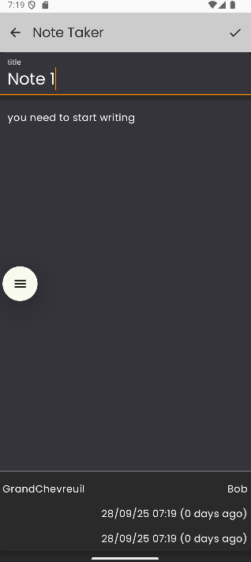
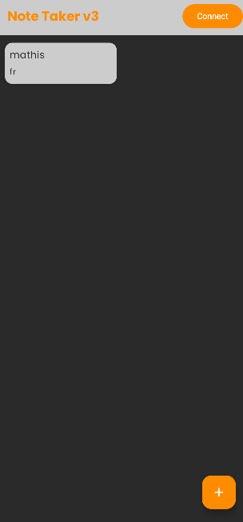

# NoteTaker

## Description
NoteTaker est une application Android moderne qui permet de créer, gérer et organiser vos notes personnelles tout en les synchronisant avec Firebase. Avec son interface élégante aux tons anthracite et orange, l'application offre une expérience fluide pour prendre, consulter et sécuriser vos notes au quotidien.

## Captures d'écran



## Fonctionnalités
- Authentification email/mot de passe ou connexion anonyme via Firebase Authentication
- Création et édition de notes avec gestion automatique des métadonnées (dates, auteur)
- Synchronisation temps réel des notes dans Firebase Firestore
- Affichage réactif de la liste des notes avec Jetpack Compose
- Suppression rapide d'une note existante
- Interface utilisateur moderne avec thème sombre et accents orange
- Police Poppins pour une meilleure lisibilité

## Design
L'application utilise un design moderne avec:
- Fond principal anthracite pour un confort visuel
- Cartes en gris clair pour distinguer facilement les notes
- Accents en orange foncé pour les éléments d'action et le titre
- Icônes blanches pour une meilleure visibilité
- Police Poppins pour l'ensemble de l'application

## Technologies utilisées
- Kotlin & Coroutines
- Jetpack Compose (Material Design 3)
- Architecture MVVM (Model-View-ViewModel)
- Firebase Authentication & Firebase Firestore
- Hilt pour l'injection de dépendances

## Configuration requise
- Android 7.0 (Nougat, API 24) ou supérieur
- Android Studio Koala Feature Drop ou supérieur
- Compte Firebase (projet configuré avec Authentication & Firestore)

## Installation
1. Clonez ce dépôt :
	```
	git clone https://github.com/GrandChevreuil/NoteTaker.git
	```
2. Créez un projet Firebase et activez l'authentification par email/mot de passe.
3. Créez une base Firestore avec la collection `notes`.
4. Téléchargez le fichier `google-services.json` et placez-le dans `app/` (remplacez celui fourni si besoin).
5. Ouvrez le projet dans Android Studio puis synchronisez Gradle.
6. Exécutez l'application sur un émulateur ou un appareil physique connecté.

## Utilisation
- Connectez-vous avec votre email/mot de passe ou créez un compte depuis l'écran d'accueil
- Appuyez sur le bouton `+` pour créer une nouvelle note
- Validez avec l'icône de confirmation pour sauvegarder dans Firestore
- Touchez une note existante pour la modifier
- Utilisez l'action de suppression dédiée pour retirer une note (suppression synchronisée)

## Notes de publication - Version 1.1.0

### Ce que l'application peut faire
- Authentifier les utilisateurs (email/mot de passe ou anonyme)
- Créer, modifier et supprimer des notes persistées dans Firebase Firestore
- Afficher les dates de création et de dernière modification directement dans l'écran détail
- Mettre à jour automatiquement la liste des notes après chaque action
- Offrir une interface responsive pensée pour mobile et tablette

### Limitations actuelles
- Pas encore de recherche ou de filtrage des notes
- Pas de catégorisation ou d'étiquettes
- Pas de mode hors-ligne complet (requiert une connexion réseau)
- Pas de pièces jointes ni de formatage riche du texte
- Pas de notifications ou rappels planifiés

## Contribuer
Les contributions sont les bienvenues! Si vous souhaitez contribuer à ce projet:

1. Forkez le projet
2. Créez votre branche de fonctionnalité (`git checkout -b feature/AmazingFeature`)
3. Committez vos changements (`git commit -m 'Add some AmazingFeature'`)
4. Poussez vers la branche (`git push origin feature/AmazingFeature`)
5. Ouvrez une Pull Request

## Contact
- Créateur du projet: GrandChevreuil
- Discord : grandchevreuil
- Lien du projet: [https://github.com/GrandChevreuil/NoteTaker](https://github.com/GrandChevreuil/NoteTaker)
