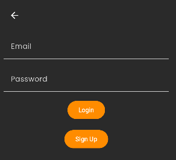

# NoteTaker

## Description
NoteTaker est une application Android moderne qui permet de créer, gérer et organiser vos notes personnelles. Avec son interface élégante aux tons anthracite et orange, l'application offre une expérience utilisateur fluide et agréable pour prendre et consulter vos notes au quotidien.

## Captures d'écran




## Fonctionnalités
- Création et édition de notes avec titre et contenu
- Vue d'ensemble des notes sous forme de grille
- Suppression de notes via un appui long
- Interface utilisateur moderne avec thème sombre
- Suivi des dates de création et de modification
- Police Poppins pour une meilleure lisibilité

## Design
L'application utilise un design moderne avec:
- Fond principal anthracite pour un confort visuel
- Cartes en gris clair pour distinguer facilement les notes
- Accents en orange foncé pour les éléments d'action et le titre
- Icônes blanches pour une meilleure visibilité
- Police Poppins pour l'ensemble de l'application

## Technologies utilisées
- Kotlin
- Jetpack Compose pour l'interface utilisateur
- Architecture MVVM (Model-View-ViewModel)
- Material Design 3
- Coroutines pour les opérations asynchrones

## Configuration requise
- Android 5.0 (Lollipop, API 21) ou supérieur
- Gradle 7.0 ou supérieur
- Android Studio Arctic Fox ou supérieur

## Installation
1. Clonez ce dépôt:
```
git clone https://github.com/GrandChevreuil/NoteTaker.git
```

2. Ouvrez le projet dans Android Studio

3. Synchronisez le projet avec les fichiers Gradle

4. Exécutez l'application sur un émulateur ou un appareil physique

## Utilisation
- Appuyez sur le bouton + en bas de l'écran pour créer une nouvelle note
- Appuyez sur une note existante pour l'éditer
- Appuyez longuement sur une note pour la supprimer
- Utilisez l'icône de validation pour enregistrer vos modifications

## Notes de publication - Version 1.0.0

### Ce que l'application peut faire
- Créer de nouvelles notes avec titre et contenu
- Afficher une liste de notes dans une interface visuellement attrayante
- Éditer des notes existantes et mettre à jour leur contenu
- Supprimer des notes indésirables via un appui long
- Afficher les dates de création et de modification des notes
- Offrir une expérience utilisateur fluide avec une interface moderne et élégante
- Présenter un design harmonieux avec des couleurs anthracite, gris clair et orange foncé

### Limitations actuelles
- L'application stocke les notes en mémoire uniquement pendant son exécution
- Les notes ne sont pas sauvegardées de façon permanente dans une base de données
- Pas de fonctionnalité de recherche parmi les notes
- Pas de possibilité de catégoriser les notes ou d'ajouter des étiquettes
- Pas de synchronisation entre différents appareils
- Pas d'options de partage des notes vers d'autres applications
- Pas de support pour les contenus riches (images, listes, formatage du texte)
- Pas de système de notifications ou de rappels

## Contribuer
Les contributions sont les bienvenues! Si vous souhaitez contribuer à ce projet:

1. Forkez le projet
2. Créez votre branche de fonctionnalité (`git checkout -b feature/AmazingFeature`)
3. Committez vos changements (`git commit -m 'Add some AmazingFeature'`)
4. Poussez vers la branche (`git push origin feature/AmazingFeature`)
5. Ouvrez une Pull Request

## Contact
- Créateur du projet: GrandChevreuil
- Discord : grandchevreuil
- Lien du projet: [https://github.com/GrandChevreuil/NoteTaker](https://github.com/GrandChevreuil/NoteTaker)
